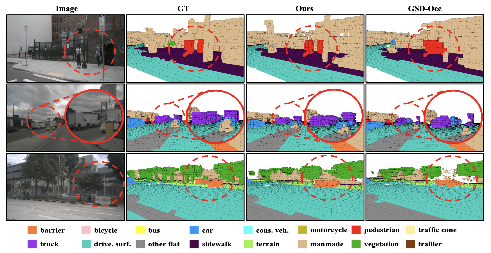
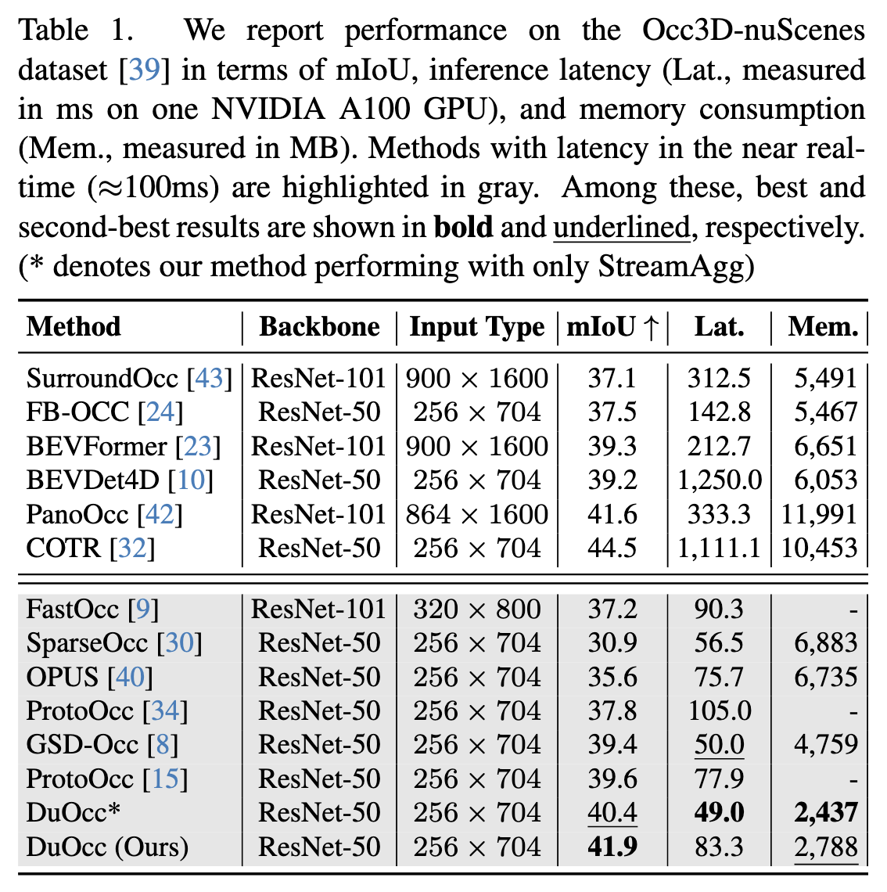
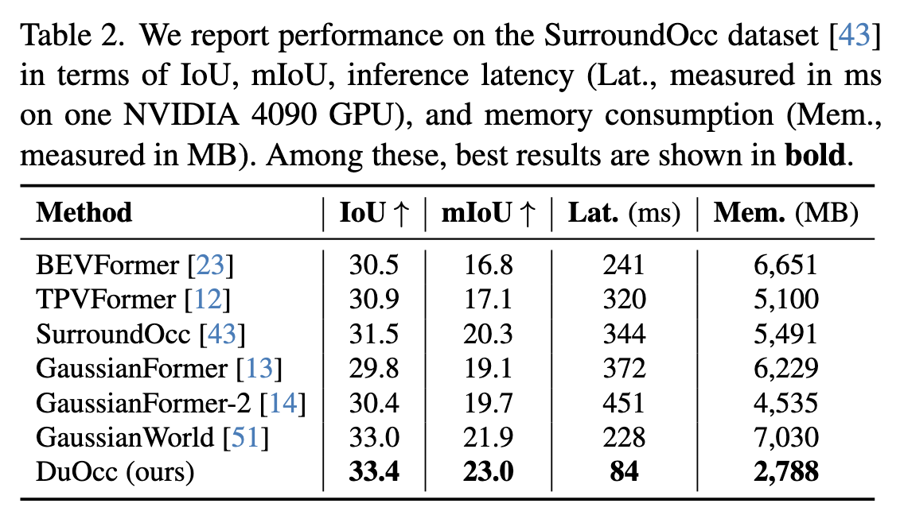

<div align="center">
<h2>DuOcc: Stream and Query-guided Feature Aggregation for Efficient and Effective 3D Occupancy Prediction</h2>

[**Seokha Moon**](https://scholar.google.nl/citations?user=HhvS9d4AAAAJ&hl=en)<sup>1†</sup> · [**Janghyun Baek**](https://scholar.google.com/citations?user=UJR1YYQAAAAJ&hl=en)<sup>1</sup> · [**Giseop Kim**](https://scholar.google.co.kr/citations?user=9mKOLX8AAAAJ&hl=en)<sup>2‡</sup> ·  [**Jinkyu Kim**](https://scholar.google.com/citations?user=-x3wvW8AAAAJ&hl=en)<sup>1</sup> · [**Sunwook Choi**](https://scholar.google.com/citations?user=R3W7dTsAAAAJ&hl=en)<sup>3</sup> 

<sup>1</sup>Korea University · <sup>2</sup>DGIST  · <sup>3</sup>NAVER LABS 

<sup>†</sup>Work done during internship at NAVER LABS, <sup>‡</sup>Work done at NAVER LABS

<a href="https://arxiv.org/abs/2503.22087"></a>

</div>

## 🚀 News
- **2025.11.29** — Code released.
- **2025.11.27** — DuOcc paper has been updated on **[arXiv](https://arxiv.org/abs/2503.22087)**.

## ✨ Highlights
- **DuOcc** introduces a **dual aggregation strategy** combining *Stream-based Voxel Feature Aggregation (StreamAgg)* and *Query-guided Feature Aggregation (QueryAgg)* for efficient and high-fidelity 3D occupancy prediction.
- Achieves **state-of-the-art performance**:
  - **Occ3D-nuScenes**: 41.9 mIoU (**+2.3** over prior SOTA / in real-time setting)
  - **SurroundOcc dataset**: 23.0 mIoU (**+1.1** over prior SOTA)
- Runs within real-time constraints (**83 ms**) and requires only **2.8 GB** of GPU memory — **over 40% less memory** than competing approaches.


## 💡 Method


DuOcc is composed of two complementary components:

### Stream-based Voxel Feature Aggregation (StreamAgg)
- Aligns and aggregates voxel features over time using motion-aware warping.
- Reduces warping artifacts via a lightweight refinement module (RefineNet).
- Preserves spatially coherent geometry and is particularly effective for static structures, whose positions remain stable after ego-motion compensation—making them inherently suitable for stream-based accumulation.
### Query-guided Feature Aggregation (QueryAgg)
- Extracts semantics of dynamic objects from image features and encodes them into propagated instance queries.
- Injects these instance-level query features into the corresponding voxel regions.
- Complements fine-grained dynamic object details that are difficult to capture through voxel accumulation alone due to motion-induced misalignment, occlusion, or sparse projection.

**StreamAgg and QueryAgg jointly produce a fast, memory-efficient, and high-fidelity 3D occupancy representation.**

## 🎨 Qualitative Results

<p align="center">
  
</p>

DuOcc provides clearer and more consistent 3D occupancy predictions, significantly improving reconstruction of both dynamic objects and fine-grained static structures compared to prior methods.

## 📊 Quantitative Results
<p align="center">
  
  
</p>

DuOcc achieves state-of-the-art performance on Occ3D-nuScenes (**41.9 mIoU**) and SurroundOcc Dataset(**23.0 mIoU**), while running at **83 ms** and using only **2.8 GB** of memory, making it one of the most efficient high-performing occupancy prediction models available. These results highlight DuOcc’s strong balance of **accuracy, speed, and memory efficiency**, making it highly suitable for real-world autonomous driving.

## 🔧 Getting Started
**Step 1.** Set up the environment:  
➡️ [`Install`](docs/install.md)

**Step 2.** Prepare datasets and PKL files:  
➡️ [`Prepare Data`](docs/prepare_data.md)

## 🏋️ Training & Inference

```bash
# Train
bash local_train.sh DuOcc
# Test
bash local_test.sh DuOcc path/to/checkpoint
```

## 🙏 Acknowledgement
This project is not possible without multiple great open-sourced code bases. We list some notable examples below.
- [open-mmlab](https://github.com/open-mmlab)
- [Occ3D](https://github.com/Tsinghua-MARS-Lab/Occ3D)
- [BEVDet](https://github.com/HuangJunJie2017/BEVDet)
- [SurroundOcc](https://github.com/weiyithu/SurroundOcc)
- [FB-OCC](https://github.com/NVlabs/FB-BEV)
- [Sparse4D](https://github.com/HorizonRobotics/Sparse4D)


## 📃 Bibtex
If this work is helpful for your research, please consider citing the following BibTeX entry.
```
@article{moon2025duocc,
  title={Stream and Query-guided Feature Aggregation for Efficient and Effective 3D Occupancy Prediction},
  author={Moon, Seokha and Baek, Janghyun and Kim, Giseop and Kim, Jinkyu and Choi, Sunwook},
  journal={arXiv preprint arXiv:2503.22087},
  year={2025}
}
```